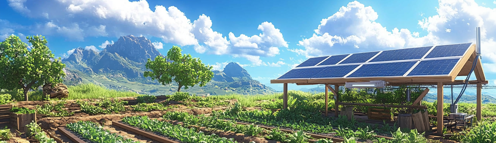

:postal_horn: Hestial
========
Next house management. This is a bunch of application/bot for the house management.

    
    
  

## :bar_chart: Hestia-core
This application collect data from the different connected devices. 
These device can be from homegarden or from other devices with a supported open protocol
It also feed data for a web server in order to display this information on a browser.
the webpage provides information about the plantation. the database is feed by the information provided by the homegarden/homebase/...

## :seedling:  Hestia-garden
This currently contain a superviser application and a bunch of tools for gardening
raspberry pi3 with sensor and activator. It should be independent with power provided by solar energy.
Futurs applications are like monitoring the state of the plantation over other devices, process automatic tasks, camera monitoring services, ...

## :house_with_garden: Hestia-Home
This currently contain a superviser application and a bunch of tools for Home usage like video camera, automatism for homeIOT, NAS, personal cloud, ...

