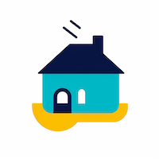

  

    <h1>
      
    </h1>
    <h4>Next house management.</h4>
  

  

    
    
    
    
    
  

# Housebot
This is a bunch of application/bot for the house management.
This currently contain a superviser application and a bunch of tools for gardening
Futurs applications are like monitoring the state of the plantation over other devices, process automatic tasks, camera monitoring services, ...

## Homebase
This application collect data from the different connected devices. 
These device can be from housebot or from other devices with a supported open protocol
Open supported protocol are : None
It also feed data for a web server in order to display this information on a browser.

## Webpage
the webpage provides information about the plantation. the database is feed by the information provided by the homebase.

## HomeGarden
raspberry pi3 with sensor and activator. should be independent with power provided by solar energy.
