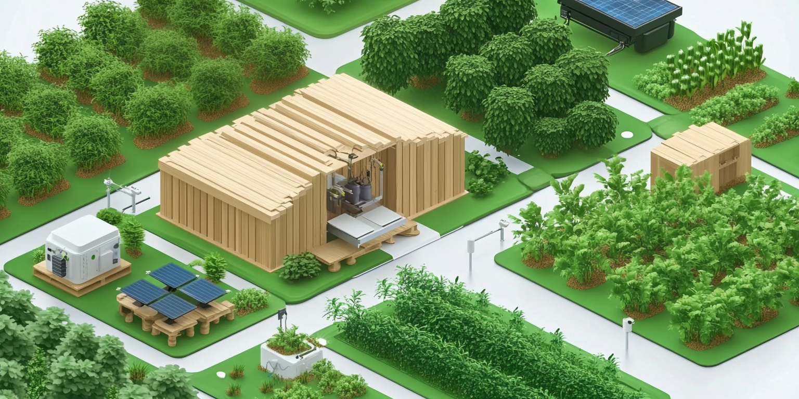

# Housebot

This document presents the expected behaviour that we want.
The strategy to use in order to code.

## Behaviour
- Temperature & humidity (DHT22)
  - https://www.didel.com/DHT22.pdf
  - https://arduinogetstarted.com/tutorials/arduino-dht22
- Quality of the air (MQ135)
  - https://www.raspberrypi.com/news/track-air-quality-anywhere-with-raspberry-pi/
  - https://github.com/Bobbo117/MQ135-Air-Quality-Sensor
- Powered by solar system and battery (powerbank)

## Implementation strategy
1. Create a build of the system
2. Database 
   * Select a database 
   * Install the database 
   * Configure the database 
3. Get the data and store them in the database
4. Send data to a cloud
   * Select a cloud
   * Configure the cloud/services
   * Synchronize the database with devices
5. Visualize the data
   * Find a tool
